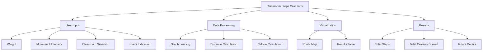

# Classroom Steps Calculator

## Overview

The Classroom Steps Calculator is a Streamlit web application designed to help students calculate the total steps and calories burned between their classes. This tool allows users to plan their route through four classrooms, considering factors such as weight, movement intensity, and the presence of stairs.

## Features

- Select four classrooms from a list of available rooms
- Input personal weight and choose movement intensity
- Option to indicate stairs between classrooms
- Calculation of total steps and calories burned
- Visual representation of the route
- Detailed breakdown of steps and calories for each leg of the journey

## Installation

1. Clone this repository:
   ```
   git clone https://github.com/yourusername/classroom-steps-calculator.git
   ```

2. Navigate to the project directory:
   ```
   cd classroom-steps-calculator
   ```

3. Install the required dependencies:
   ```
   pip install -r requirements.txt
   ```

## Usage

1. Run the Streamlit app:
   ```
   streamlit run app.py
   ```

2. Open your web browser and go to the provided local URL (usually http://localhost:8501)

3. Input your weight, select movement intensity, and choose your classrooms

4. Click the "Calculate Route" button to see your results

## Project Structure



## Dependencies

- Streamlit
- NetworkX
- Pandas
- Plotly

## Data Source

The application uses a JSON file (`classroom-steps-dataset.json`) containing information about the steps between different classrooms. Ensure this file is present in the project directory.

## Contributing

Contributions are welcome! Please feel free to submit a Pull Request.

## License

This project is licensed under the MIT License - see the LICENSE file for details.
```

